# Concurrencia y Paralelismo

## Integrantes:
- Crhystian Molano
- Julian Caceres

## *Descripción Del Laboratorio*
A continuación, se realizará un ejercicio partico donde entenderemos un poco mas sobre los hilos en java.

## *PARTE I*

1. La clase CountThread se define implementando la interfaz Runnable, por motivos de flexibilidad y agilidad en el código.
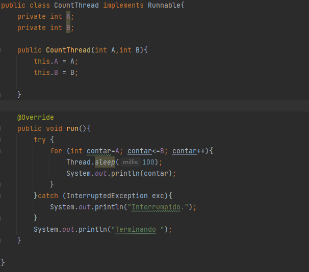

2. Ejecución de los hilos en Main con start()

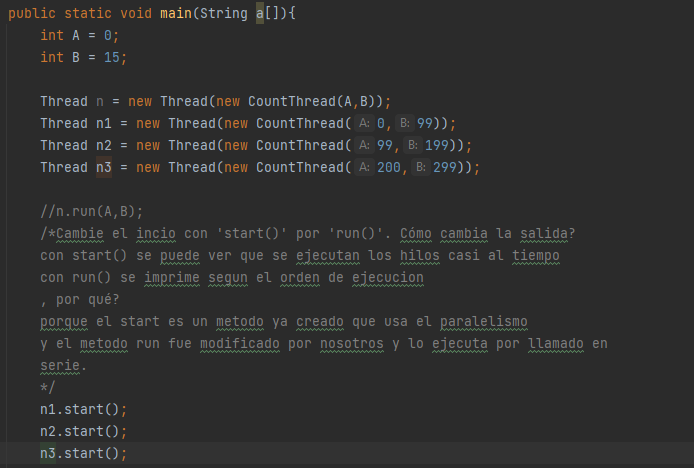
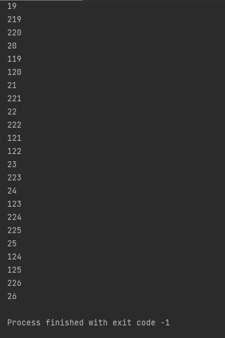

3. Cambiando el método a run()

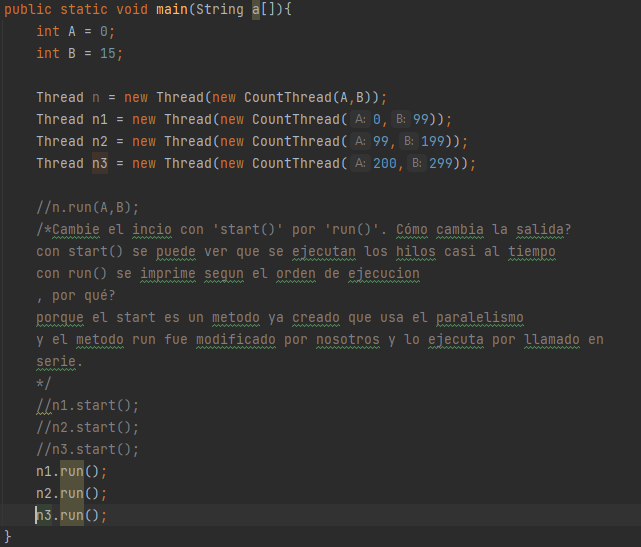
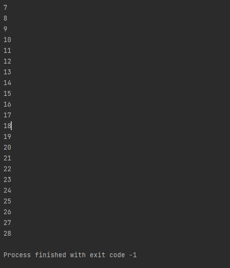

- Cambie el incio con 'start()' por 'run()'. Cómo cambia la salida?
        con start() se puede ver que se ejecutan los hilos casi al tiempo
        con run() se imprime segun el orden de ejecucion 
- por qué?
        porque el start es un metodo ya creado que usa el paralelismo
        y el metodo run fue modificado por nosotros y lo ejecuta por llamado en 
        serie.

## *PARTE II*

1. La clase encargada de la lógica del hilo es HostBlackListsValidatorThread. Como la documentación especifica que debe ser de tipo "Thread",
se realizó una extensión de esa clase. 
	- Se implementaron los métodos necesarios para las necesidades de HostBlackListsValidator
	- Se sobrecargó el método "run()" de la clase Thread debido a que este es el que ejecuta la lógica de validación

2. Se realizó una prueba con las direcciones IP dada en el documento.

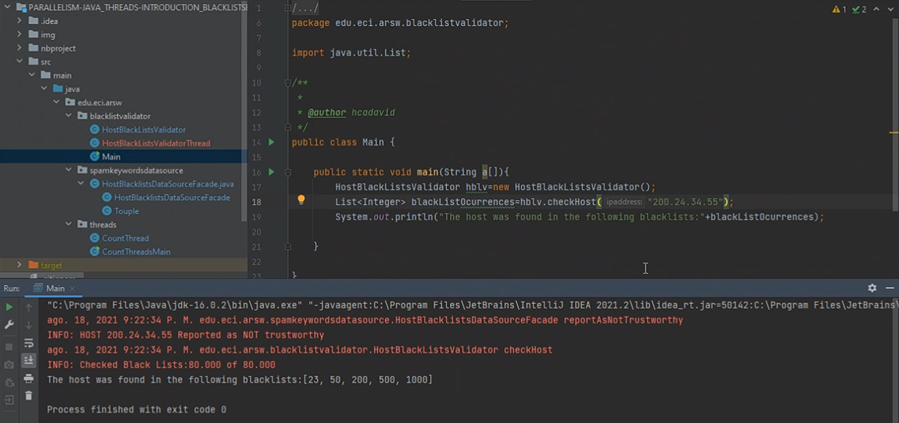 
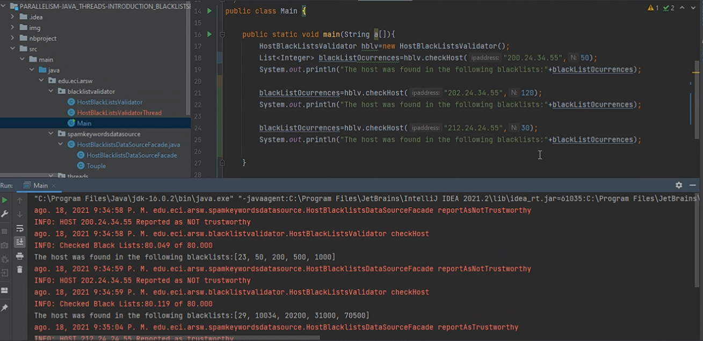
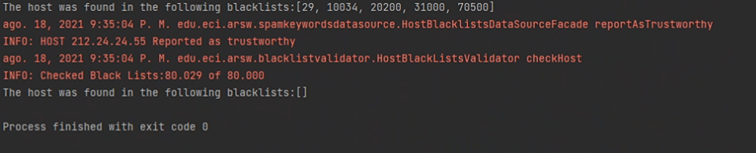

## *PARTE II.I*

1. Para mejorar la implementación se utiliza la técnica de **Memoria Compartida** utilizando un **Monitor** como mecanismo de sincronización.
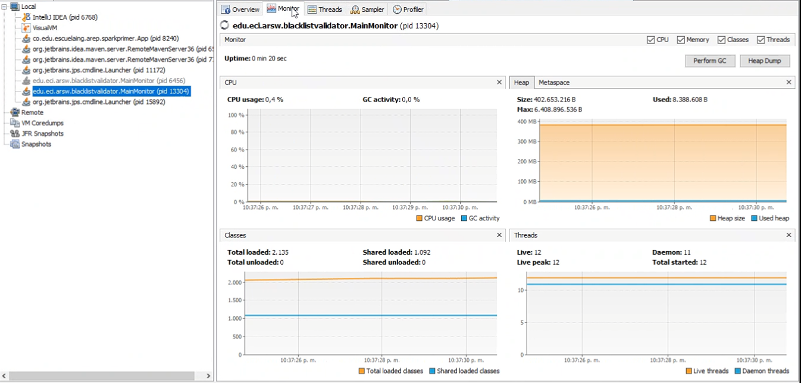

2. Se realizó una extensión de la clase Thread que se creó para el ejercicio, dado que la zona crítica es muy pequeña y se puede reutilizar gran parte
de la lógica creada.

## *PARTE III*

1. Ejecución con un hilo

2. Ejecución con los núcleos del pc (2 núcleos)

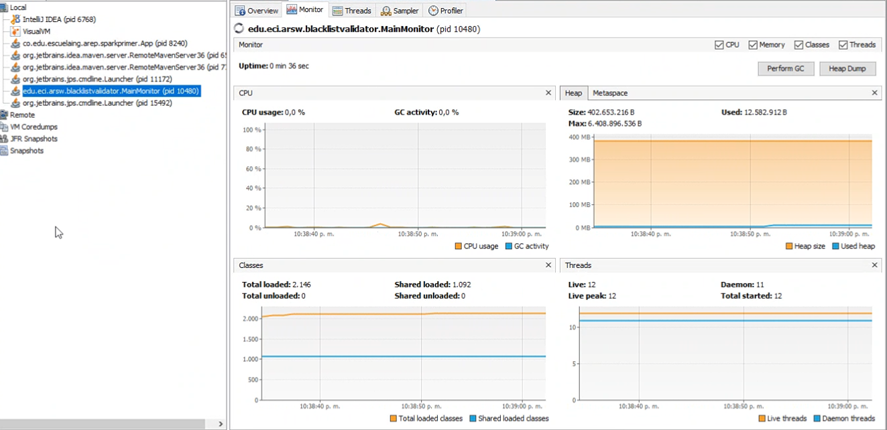

3. Ejecución con el doble de los núcleos del pc

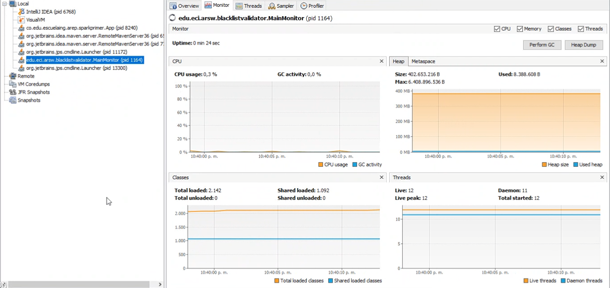

4. Ejecución con 50 hilos

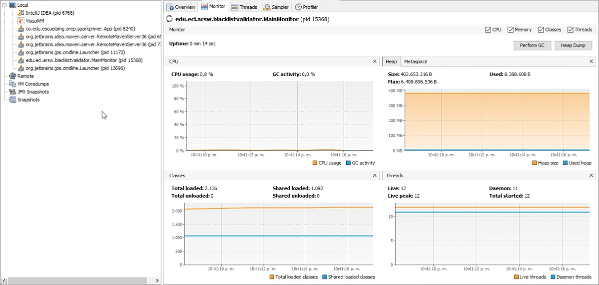

5. Ejecución con 100 hilos

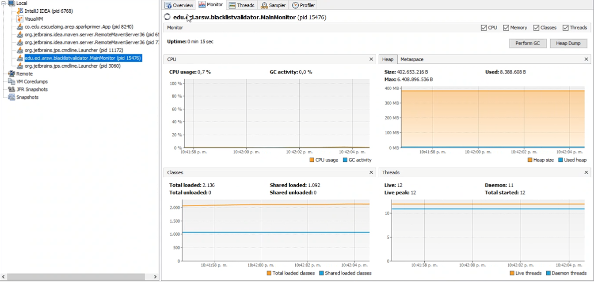

### Preguntas

- La ley de Amdahl, nos ayuda a revisar la mejora de rendimiento reflejada a la cantidad de hilos usados durante el proceso de ejecución, el primer caso en la ejecución del programa utilizando un hilo obtuvimos un rendimiento un 1:40 minuto con cuarenta segundos, mientras que el 
siguiente nos tomó significativamente menos tiempo durante su ejecución en total unos 12 doce segundos. esto nos deja en claro que a medida que se aumentan la cantidad de hilos se tornara más corto el tiempo de ejecución, así que el rendimiento esperado para los 200 a 500 hilos usado el 
aumento no es significativo ya que a mayor cantidad de hilos se acercaran a un tiempo constante durante la ejecución del programa.

- Se usaron 8 hilos con un tiempo aproximado de 4 segundos en cambio los 4 hilos se demoraron aproximadamente 3 segundos, se concluye que a mayor cantidad 
de hilos no se obtendrá una mejora en el rendimiento significativa.

- Al usar 100 computadoras obtendríamos un aumento del rendimiento ya que no se esta realizando una mejora en ninguna de las computadoras solo realizaremos una disminución de este 
rendimiento al tratar de coordinar las maquinas, a pesar de todo al aumentar los hilos nos acercaremos a un tiempo constante lo que permitirá un mayor aumento de rendimiento del programa 
que no será significante. Las ventajas de usar 100 CPUs diferentes se pierde si hay que sincronizarlos.

